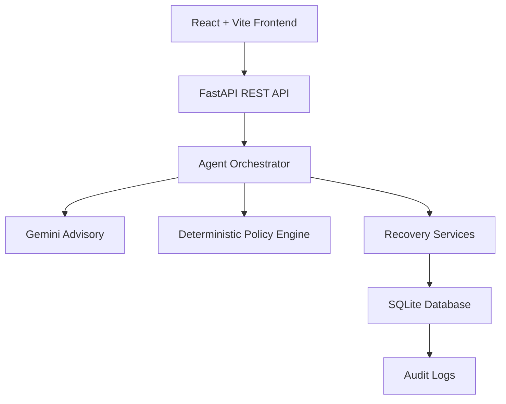

# RecoverAI — Autonomous Payment Recovery Agent

## One-Line Description

RecoverAI is an autonomous payment recovery agent that detects failed payments, diagnoses failure causes using Gemini, selects a bounded recovery strategy, enforces deterministic business policies, executes a recovery action, verifies the outcome, and records an auditable trail.

## Problem

Failed payments create direct revenue leakage for merchants. Traditional payment recovery systems often rely on static retry rules or manual intervention, which cannot adapt to the nuanced reasons behind payment failures. Different failure types — such as insufficient funds, network errors, expired cards, or risk declines — require different recovery strategies. Meanwhile, risky transactions should not be automatically retried without proper safeguards. This gap leads to lost revenue, poor customer experience, and operational overhead.

## Solution

RecoverAI implements a seven-stage autonomous recovery pipeline:

**Detect** — Continuously monitors for failed payments from the payment gateway.

**Diagnose** — Uses Google Gemini to analyze failure context (error codes, payment history, customer signals) and classify the root cause with a recovery probability estimate.

**Decide** — Selects a recovery strategy from a bounded action space: retry payment, send recovery reminder, generate payment link, or escalate to human review.

**Policy Check** — Enforces deterministic business rules: retry limits, risk thresholds, amount caps, and cooldown periods. Policies are authoritative and cannot be overridden by AI recommendations.

**Execute** — Invokes the selected recovery action via a mock/test gateway (simulated for prototype).

**Verify** — Confirms the recovery outcome by checking transaction status before updating payment state.

**Audit** — Records an immutable-style audit trail capturing every decision, policy evaluation, and execution result for compliance and debugging.

## Key Features

- **AI-assisted payment failure diagnosis** — Gemini analyzes failure context and provides structured reasoning
- **Recovery probability estimation** — Quantified confidence scores for each recommended action
- **Autonomous recovery strategy selection** — Chooses from retry, reminder, payment link, or escalation
- **Deterministic policy guardrails** — Hard-coded business rules that cannot be bypassed by AI
- **Risk-based escalation** — High-risk payments automatically routed to human review
- **Retry payment** — Automated retry with exponential backoff and limits
- **Recovery reminders** — Customer notification workflows for actionable failures
- **Payment link generation** — Creates new payment links for expired or cancelled payments
- **Recovery verification** — Confirms actual settlement before marking recovered
- **Immutable-style agent audit trail** — Complete decision log for every recovery attempt
- **Real-time operations dashboard** — Live metrics on revenue at risk, recovery rates, and agent activity
- **Gemini advisory reasoning with deterministic fallback** — Structured output with fallback diagnosis if Gemini is unavailable

## Example Recovery

**Payment #101**
- Failure: `NETWORK_ERROR`
- Amount: ₹24,691.92
- Gemini recommendation: `RETRY_PAYMENT`
- Recovery probability: 82%
- Policy: `APPROVED`
- Execution: `SUCCESS`
- Amount recovered: ₹24,691.92
- Final status: `RECOVERED`

> **Note:** This recovery is simulated using a mock gateway. No real funds are moved.

## Guardrails

- **Gemini is advisory only** — The model provides recommendations and reasoning; it never directly executes payments.
- **Gemini cannot directly execute payments** — All execution flows through the deterministic policy engine.
- **Deterministic policy rules are authoritative** — Retry limits, risk thresholds, and amount caps are enforced in code and cannot be overridden by AI output.
- **High-risk payments are escalated** — Payments exceeding risk scores or velocity limits are routed to manual review queues.
- **Retry limits are enforced** — Maximum retry attempts per payment are hard-coded and tracked.
- **Recovery is verified before marking a payment recovered** — The agent confirms actual settlement status via the gateway before updating state.
- **Fallback diagnosis is available if Gemini is unavailable** — A rule-based classifier provides deterministic diagnosis when the AI service is unreachable.

## Architecture



**Agent Lifecycle:**

```
Detect → Diagnose → Decide → Policy Check → Execute → Verify → Audit
```

## Technology Stack

**Frontend**
- React
- Vite
- Axios
- React Router
- Recharts
- Lucide React

**Backend**
- Python
- FastAPI
- SQLAlchemy
- SQLite

**AI**
- Google Gemini API
- Gemini 2.5 Flash
- Structured Pydantic output

## API Endpoints

| Method | Endpoint | Description |
|--------|----------|-------------|
| GET | `/health` | Service health check |
| GET | `/payments` | List all payments with pagination |
| GET | `/payments/{payment_id}` | Get payment details and recovery history |
| POST | `/agent/run/{payment_id}` | Trigger autonomous recovery for a payment |
| GET | `/dashboard/stats` | Aggregate metrics for dashboard |
| GET | `/agent/logs` | Retrieve agent audit logs |
| GET | `/recovery/actions` | List available recovery action types |

## Project Structure

```
recover-ai/
├── backend/
│   ├── main.py                 # FastAPI application entry point
│   ├── models.py               # SQLAlchemy models
│   ├── schemas.py              # Pydantic request/response schemas
│   ├── database.py             # Database configuration
│   ├── agent/
│   │   ├── orchestrator.py     # Agent pipeline coordinator
│   │   ├── diagnosis.py        # Gemini diagnosis service
│   │   ├── policy.py           # Deterministic policy engine
│   │   ├── execution.py        # Recovery action execution
│   │   ├── verification.py     # Recovery verification
│   │   └── audit.py            # Audit logging
│   ├── services/
│   │   └── mock_gateway.py     # Simulated payment gateway
│   └── requirements.txt
├── frontend/
│   ├── src/
│   │   ├── components/         # Reusable UI components
│   │   ├── pages/              # Page components (Dashboard, PaymentDetail, etc.)
│   │   ├── services/           # API client (Axios)
│   │   ├── hooks/              # Custom React hooks
│   │   └── App.tsx             # Root component with routing
│   ├── package.json
│   └── vite.config.ts
└── README.md
```

## Running Locally

### Backend

```bash
cd backend

# Activate virtual environment (Windows)
venv\Scripts\activate

# Or on macOS/Linux
source venv/bin/activate

# Install dependencies
pip install -r requirements.txt

# Set required environment variable
# GEMINI_API_KEY=your_api_key_here

# Start server
uvicorn main:app --reload
```

The API will be available at `http://localhost:8000`. API docs at `http://localhost:8000/docs`.

### Frontend

```bash
cd frontend

# Install dependencies
npm install

# Start development server
npm run dev
```

The dashboard will be available at `http://localhost:5173`.

> **Security Note:** `GEMINI_API_KEY` must be provided through environment variables and must never be committed to GitHub or included in the repository.

## Demo Flow

1. Open the **Overview dashboard** — observe revenue at risk and recovered revenue metrics.
2. Navigate to **Failed Payments** and open payment **#101**.
3. Click **Run Recovery Agent** to trigger the autonomous pipeline.
4. View the **Gemini diagnosis** — failure classification, reasoning, and recovery probability.
5. Observe the **Policy Check** — deterministic guardrail evaluation and approval.
6. Watch the **execution** — simulated retry via mock gateway.
7. Confirm **₹24,691.92 recovered** with verification step.
8. Review the **audit trail** — complete decision log with timestamps.

## Build Challenges & Technical Decisions

- **Making Gemini recommendations reliable** — Used structured Pydantic output parsing with strict schema validation to eliminate hallucinated or malformed responses.
- **Preventing AI from bypassing business rules** — Architected Gemini as a pure advisory component; all execution authority resides in the deterministic policy engine.
- **Handling Gemini/API failures with deterministic fallback** — Implemented a rule-based classifier that activates automatically when the AI service is unavailable or returns low-confidence results.
- **Coordinating multi-step agent execution** — Designed the orchestrator as an explicit state machine with clear stage boundaries, enabling observability and replay.
- **Maintaining an auditable decision trail** — Every stage writes an immutable audit record capturing inputs, decisions, policy evaluations, and outcomes.
- **Connecting the React dashboard to the FastAPI agent backend** — Built a typed API client with React Query patterns for real-time polling during agent execution.

## Future Improvements

- Real Razorpay payment event integration via webhooks
- Production payment gateway integrations (Razorpay, Stripe, etc.)
- PostgreSQL or durable event store for production workloads
- More sophisticated recovery policies with merchant-specific tuning
- Merchant-specific recovery strategies based on vertical and customer segment
- Offline evaluation framework for agent decisions (A/B testing, shadow mode)
- Production observability: distributed tracing, alerting, and SLO dashboards
